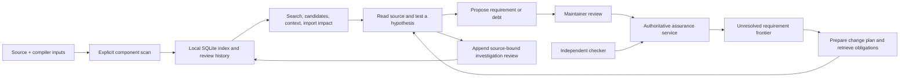
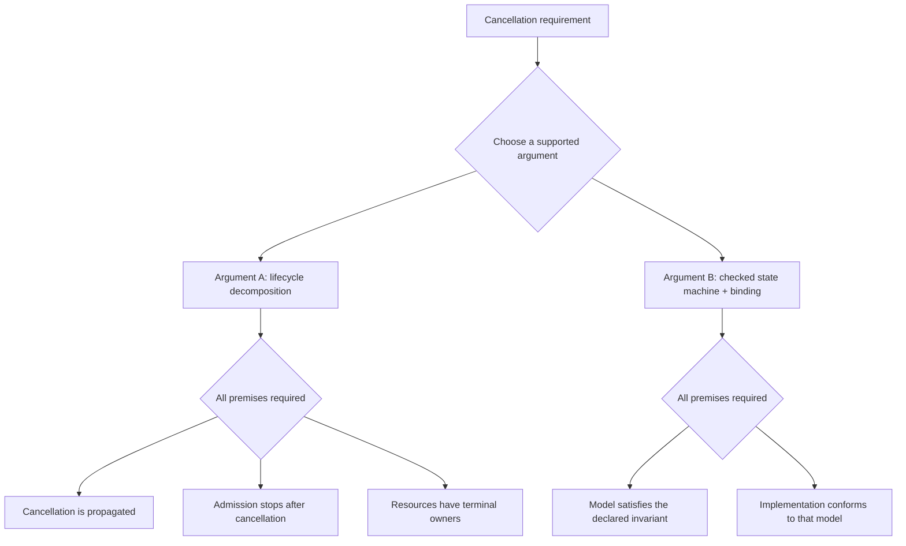

# Concepts: from investigation to reusable assurance

Assurance Memory helps an agent find a useful next piece of work without loading an entire codebase into its context. It also keeps reviewed requirements and evidence reusable across changes. These are related tasks with different authority: a source-derived candidate suggests an investigation; a reviewed obligation specifies what must remain true.

Read the [local workflow](LOCAL_WORKFLOW.md) to try investigation, the [local reference](LOCAL_REFERENCE.md) for commands and result semantics, and [architecture](ARCHITECTURE.md) for implementation invariants.

## Two connected workflows



There is no automatic promotion from an index finding to an approved requirement, passing evidence or closed debt. Local investigation works without a service. The service becomes useful when a team needs durable policy, evidence, reviewed decomposition, shared change coordination or debt decisions.

| Question | Local investigation projection | Assurance service |
|---|---|---|
| What does it contain? | Current extracted facts, candidates, import edges, scan metadata, drift and retained local reviews | Reviewed claim revisions, arguments, component heads, evidence, counterevidence, plans, decisions and debt |
| What can it establish? | That the configured extractor emitted a summary at a recorded scan | Current support under a declared evidence policy |
| Who supplies inputs? | A person or agent running the scanner or explicitly appending a user-reported review | Separately authorized scanner, maintainer, agent and runner roles |
| What is its lifetime? | Source facts are rebuildable; user review records must be preserved before replacing the database | Durable policy/evidence history with an explicit retention policy |
| What does absence mean? | No result was returned by that bounded query over that extraction | Assessment depends on declared scopes, coverage, evidence and current applicability |
| Can it authorize a release? | No | The gate can issue an exact-state receipt; external Git/deployment integration must enforce it |

## The vocabulary

**Component.** An explicit build-target boundary with a root, configuration and compiler inputs. It is a unit of extraction and applicability. An arbitrary folder split can hide imports or omit the build context; choose boundaries that correspond to real project structure.

**Fact or subject.** A compact source summary with component-relative path, locator, kind, language, content/signature hashes, tags, effect summaries, metrics and a line number. Subject identity is SHA-256 of `component + ':' + locator`. This is a reproducible source identity, not a proof of behavior. Named declarations usually survive line movement; anonymous or colliding declarations can be position-bound.

**Candidate.** A rule's reason to inspect a subject. For example, an empty catch could conceal a failure, but it could also implement a deliberate best-effort path. Candidates retain their source location, rule, priority and a requested validation step. Their confidence is `STATIC_CANDIDATE`.

**Requirement or claim.** An approved statement with owner, scope, assumptions/definitions and required checks. A stable ID groups immutable reviewed revisions. Source comments, documentation and agent proposals remain untrusted input until the appropriate authority approves a requirement.

**Argument.** An immutable, reviewed explanation that specified premise revisions are jointly sufficient for a conclusion revision. It records rationale and limitations. An argument is a structured review decision, not a machine-checked logical implication from arbitrary prose.

**Evidence.** A separately authorized checker result with kind, checker/version, claim revision/generation, context dependencies, artifact digest/URI and limitations. Historical retention and current applicability are separate. The service records artifact metadata; it does not dereference or independently verify the contents at every URI.

**Debt.** An explicit liability record: the mechanism making future work harder, likely future-change scenarios, owner, affected requirements, repayment requirements, supporting observations and reviewed disposition. A low score, a long method or a disappearing warning is not a debt valuation or a repayment decision.

**Memory.** A descriptive note, incident, hypothesis, procedure or handoff with author, provenance, scope and freshness. It helps agents retain context. It cannot override approved policy or turn a hypothesis into evidence.

## What a useful debt investigation looks like

Suppose the local backlog flags a function with 14 conditional decisions and several state-changing effects. The next useful question is concrete: “When we add another payment retry policy, how many owners and files must agree?” Counting branches alone does not answer it.

An investigation can establish that three adapters independently decide whether an operation can retry. One adapter allows retries after cancellation, another does not, and an incident shows why that distinction matters. The liability's mechanism is duplicated policy ownership with inconsistent assumptions. A possible repayment is one policy owner with explicit lifecycle inputs, leaving adapter-specific I/O at the edges.

The proposed requirement might be “After cancellation is observed for execution E, no new payment attempt for E starts.” Its assumptions need to define observation, execution identity, already-started work and the boundary being checked. The repayment check should fail for the current inconsistency and pass after the bounded change. A second observation can compare how many policy definitions or files must change when a new retry reason is added.

This workflow produces reusable information even if the initial candidate was wrong. Record the intentional boundary, counterexample or rejected hypothesis with provenance. A reviewed debt item should explain future work and repayment, not merely repeat the diagnostic message.

## Evidence support and uncertainty

| Assessment | Interpretation |
|---|---|
| `SUPPORTED` | The currently applicable declared evidence policy is satisfied, including any required reviewed argument. |
| `UNKNOWN` | Support cannot currently be established: evidence may be missing, stale, inconclusive or expired; discovery/semantics or a decomposition may be unresolved. |
| `VIOLATED` | The claim has applicable submitted counterevidence. |

These are policy-relative assessments. Passing tests cover their exercised scenarios. A finite model covers its stated abstraction and bounds. A review supports its reviewed assumptions. None automatically establishes unrestricted implementation correctness.

Partial `PASS` evidence becomes `UNKNOWN`. A relevant scope or environment change invalidates applicability. A same-generation failure remains sticky: a green rerun does not erase it. Fixing the implementation or independently reviewing a changed requirement/checker creates a new applicable context while preserving the historical failure.

There is also a distinction between a failed premise and a disproved conclusion. If a required premise lacks support, the argument cannot establish its conclusion. That does not logically disprove the conclusion; another argument may work. Direct applicable counterevidence against a claim remains a violation regardless of a supported alternative argument.

## Revisions, generations and snapshots

| Identity | What changes it? | Why it exists |
|---|---|---|
| Claim `revision` | Maintainer approval of a new requirement definition | Prevents silent adoption of changed intent |
| Claim `generation` | Approval or relevant implementation, context or argument invalidation | Distinguishes applicability of evidence to the same requirement revision |
| Service component `head` | An accepted component publication that changes the represented state | Pins source and semantic context; no-op publication can retain the existing head |
| Local `snapshot` | Every successful local workspace scan | Pins query results and local pagination, even when the facts are unchanged |
| Plan pins | Captured during `plans.prepare` | Bind proposed work to heads, requirement revisions/generations, policy epoch and write scope |

An argument pins premise **revisions**. When a premise's relevant code changes, it can regain support after checks for its new generation pass. When the premise's statement revision changes, the argument must be reviewed again; it cannot silently point to the replacement statement.

A component/source scope includes membership, so a new file matching a watched tag can invalidate an obligation that previously covered existing files. This prevents yesterday's exact subject list from being used as absence evidence for a universal claim. It still depends on what the configured extractor can identify: a heuristic `writers` tag does not guarantee discovery of every framework-specific write path.

## The reviewed mission frontier

The frontier answers: **What unresolved work remains under this approved root requirement, and what alternatives connect that work to the root?** It is a read-only view of current assessments and reviewed arguments. It does not invent a decomposition, assign work, approve requirements or acquire a write lease.

Consider this illustrative argument graph:



Inside an argument the premises are **AND**: every current pinned premise must be supported. Different arguments are **OR** routes: any supported reviewed argument can satisfy the argument portion of the conclusion. A successful model alone cannot close route B while its implementation binding is unresolved.

The claim mode controls additional work:

| Mode | Required support |
|---|---|
| `DIRECT` | All declared direct checks; decomposition arguments cannot be approved for this mode. |
| `DECOMPOSED` | At least one supported reviewed argument, plus any explicitly declared checks. Checks may be empty. |
| `BOTH` | All declared direct checks **and** at least one supported reviewed argument. It is not “either direct or decomposed.” |

Coverage and context requirements still apply to all modes. Arguments have 1–100 distinct premises and pin current approved revisions at approval time. Circular arguments are rejected; a mutually dependent system needs an independently checked joint invariant rather than a circular support chain.

Call the service through the generic CLI:

```sh
node packages/agent/dist/src/cli.js call claims.frontier --json frontier.json
```

`frontier.json`:

```json
{ "id": "payments.cancellation", "limit": 20, "maxClaims": 500 }
```

The same operation is exposed as `assurance_frontier` in **service MCP mode**. It is not one of the seven local index tools.

| Request field | Contract |
|---|---|
| `id` | Existing approved root claim ID |
| `limit` | Page size 1–500, default 100, following service pagination |
| `maxClaims` | Traversal budget 1–5,000, default 500 |
| `after` | Last returned claim ID; omit for the first page |
| `fingerprint` | Required with a nonempty `after`; use the exact value returned by the first page |

The response includes `root`, `rootStatus`, `fingerprint`, `items`, `hasMore`, `next`, `reachableClaims`, `unresolvedClaims`, `truncated: false` and a meaning statement. Items sort by claim ID, not priority or estimated effort. Each contains its `id`, `revision`, `generation`, statement, owner, status, declared checks, `reasonKinds`, suggested `action` and argument `alternatives`.

| Suggested action | Meaning |
|---|---|
| `CHECK_OR_REPAIR_LOCAL_OBLIGATION` | Reasons beyond a missing supported argument need attention, such as stale evidence, missing context or counterevidence. “Local” here means the claim's own obligation, not the SQLite index. |
| `PROPOSE_REVIEWED_DECOMPOSITION` | The only obstacle is a missing supported argument and no applicable conclusion argument exists. A proposal still requires review. |
| `RESOLVE_ARGUMENT_ALTERNATIVE` | Choose an existing reviewed route and resolve its blockers. |

An illustrative alternatives excerpt:

```json
{
  "alternatives": [
    {
      "argumentId": "cancellation-lifecycle-v1",
      "allRequired": [
        { "id": "payments.admission", "action": "RESOLVE_PREMISE", "status": "UNKNOWN" },
        { "id": "payments.cleanup", "action": "REVIEW_ARGUMENT_REVISION", "pinnedRevision": 1, "currentRevision": 2 }
      ]
    },
    {
      "argumentId": "cancellation-model-v1",
      "allRequired": [
        { "id": "payments.model-binding", "action": "RESOLVE_PREMISE", "status": "UNKNOWN" }
      ]
    }
  ]
}
```

`allRequired` lists the **remaining blockers**, not every original premise. Supported premises are omitted from that list. Retrieve the argument through `claims.explain` for its complete premises and rationale. A revision mismatch is a review task; its replacement premise is not silently adopted or expanded through that stale edge. An argument with no blockers can coexist with the claim's own unresolved direct checks.

The query gathers current-conclusion argument reachability before selecting unresolved routes. A supported root returns no frontier items. Traversal budgets still apply to the gathered graph, even if a route is already supported: exceeding `maxClaims` or 20,000 inspected premise edges fails rather than returning a partial frontier. Select a smaller root or explicitly raise the claim budget. These bounds are not a scheduler or an organization-scale graph service.

Continue while `hasMore` is true, supplying both `after: <next>` and the returned `fingerprint`. A changed frontier returns HTTP 409; a missing continuation fingerprint or exceeded budget returns HTTP 400. Restart at the root after a conflict and reconsider the current state. The fingerprint covers the returned assessment/revision view; it is not a code lock. Before editing, prepare a plan, retrieve every mandatory obligation and acquire the required semantic leases through the normal [agent protocol](AGENT_PROTOCOL.md).

## The Prove2Me inspiration and its boundary

Prove2Me organizes collaborative formalization around immutable theorem statements, reviewed mission cores and reusable proof sketches. A sketch reduces a target to imported statements; all imports must close, while another sketch can offer a different route. Lean checks submitted proofs against the target and pinned environment. Its authors also describe smaller, reusable verification units as a way to coordinate many contributors. [Prove2Me primary description](https://prove2.me/about); [Chen et al., *Prove2Me: An Open Collaborative Platform for Scaling Math Formalization*, version 2](https://arxiv.org/abs/2608.28433v2).

Assurance Memory's adaptation is an engineering inference: keep canonical requirements, reviewed reductions, explicit unresolved work and evidence tied to its assumptions. A software requirement written in prose and a reviewer-approved sufficiency argument lack Lean's machine-checked implication guarantee. A test suite or bounded model also needs a separately justified connection to deployed behavior. The system therefore preserves partial coverage, stale arguments and counterevidence rather than treating a graph edge or green test as a general proof.

No Prove2Me code is incorporated. The analogy guides workflow design; it does not claim equivalent soundness, verification performance or project-scale guarantees. Sources were checked on 2026-09-07.

## What “large-project ready” means here

The current implementation supports bounded investigation pilots: explicit components, persistent local search, atomic scans, consistent bounded queries, a durable service and measured tests. It does not establish production capacity for arbitrary repositories.

The next useful evidence is project-specific: whether maintainers agree that candidates identify worthwhile work, whether known changes invalidate relevant obligations, whether retrieved context is sufficient to avoid missed dependencies, and whether reviewed simplifications reduce the cost of likely future changes. [Scaling](SCALING.md) separates those acceptance questions from synthetic projection performance. [Extension criteria](EXTENDING.md) describe the engineering checks required before expanding detectors or language coverage.

Cross-repository contract federation, distributed extraction, full call/data-flow graphs, automated model-to-code refinement, retention compaction and general Python/Go/Rust semantic adapters are not implemented. The architecture leaves room for them without granting new discovery mechanisms policy authority.

## Source anchors

The authoritative behavior lives in [Claims.java](../services/core/src/main/java/dev/assurance/core/Claims.java), [Frontier.java](../services/core/src/main/java/dev/assurance/core/Frontier.java), [MemoryDebt.java](../services/core/src/main/java/dev/assurance/core/MemoryDebt.java) and [Kernel.java](../services/core/src/main/java/dev/assurance/core/Kernel.java). Local candidate and snapshot behavior is implemented in [investigation.ts](../packages/agent/src/investigation.ts) and [local-index.ts](../packages/agent/src/local-index.ts). See [the API](API.md) for review, evidence and debt requests.
