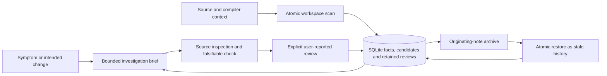

# Decision: connect task context, retained recovery and falsifiable evaluation

Status: implemented for Node tooling 1.3.0 / local schema 3. The Java assurance kernel remains unchanged. Production detector activation and agent-efficiency claims require separate evidence.

An agent previously had to compose search, source context, candidate ranking and review history itself. Moving or rebuilding its index could also strand retained annotations. The earlier agent calibration established successful repairs in both arms, without demonstrating an efficiency benefit. These problems call for a smaller investigation entry point, recoverable history and stronger evaluation, while preserving the existing source and authority contracts.

## Contracts and minimal concepts

`investigate(task, limit, maxBytes)` composes existing reads inside `localQuery`'s single SQLite snapshot. It introduces one returned brief, with explicit lexical term selection, file/byte limits, coverage and omitted subjects. Candidates are read for at most three visible subjects per entry. Neither nearby symbols nor empty candidate lists imply complete file or call-graph coverage. CLI and MCP share this behavior; local MCP now exposes eight read-only tools.

SQLite remains the only local review store and scan reconciliation remains its freshness owner. A canonical archive transfers distinct originating annotations and their captured provenance; it does not become a second live state store. Restore appends records and permanent invalidations atomically, deduplicates unchanged origins and preserves the precedence of local submissions. Restored notes remain stale or absent. Complete archives fail on their 10,000-record/16 MiB bounds; full SQLite backups preserve additional scan/drift/restore audit history.

Schema 3 prevents older tools from interpreting restored annotations as current local conclusions. Scan migration, search rebuild and source publication commit together. Read-only export cannot migrate schema 2. Upgrading the scanner can change captured context and stale notes even with unchanged project source; preservation of history does not promise preservation of applicability. Profiling within the same scanner build adds observations without changing source/context identities.

The lifecycle lab separates an explicit oracle from actual pinned synthetic implementations and trusted adapter execution. Reports distinguish executed observations, model-only input and incomplete coverage. The reuse example attaches report assumptions and digests through the existing local review path; re-execution or source reversion cannot revive an invalidated note. The lab adds no scanner rule or alternate evidence authority.

The Python pilot harness owns evaluator state: frozen inputs, randomized assignments, separate candidate copies, protected patch evaluation and complete outcome denominators. Provider success and protected test success remain separate from independent reviewer acceptance. Tool availability and observed tool use are also separate measurements. Source/task banks and detailed private artifacts remain outside public documentation.

## Ownership, change surface and proof surface

The scan reconciles captured dependencies before publication. A successful check or recovered note cannot bypass review freshness or the separate assurance kernel's evidence policy.

| Concern | Implementation owner | Change boundary and required evidence |
| --- | --- | --- |
| Brief composition | `local-investigate.ts`, through `local-query.ts` | Presentation changes stay outside persistence; verify snapshot consistency, byte accounting and propagated omissions |
| Review applicability and restore | `local-review.ts`, transaction boundary in `local-index.ts` | One owner selects effective reviews and permanently invalidates captures; verify restore, retry, disappearance and reversion behavior |
| Archive format | `local-review-archive.ts` | One canonical bounded contract for import/export; verify corruption rejection, complete records and origin identity |
| Scan diagnostics | `scan.ts`, presentation in `local-cli.ts` | Measure analysis and ingestion separately; preserve facts, coverage and context for a profile toggle |
| Lifecycle discrimination | `lifecycle-lab.ts` and explicit fixture adapters | Independent observable-state oracle, source/contract/trace pins, negative controls and replayable first divergence |
| Agent outcomes | `scripts/pilot/harness.py` and evaluator-owned inputs | Protected checks plus independent mechanism/scope review, source-owner audit and all assigned costs |

The added boundaries follow distinct contracts rather than introducing a general policy language, detector plugin framework, compiler cache or duplicated review store. Their proof obligations remain local: query completeness disclosures, recovery semantics, source-pinned fixture behavior and independently accepted task outcomes cannot substitute for one another.

## Measured scorecard

These are observed workload results and explicit evidence gaps, not subjective quality scores. Full regression and durable-service checks are recorded in the [1.3 validation report](../VALIDATION_1_3.md).

| Question | Observed evidence | Limit |
| --- | --- | --- |
| Does the brief stay bounded with broad matches and retained history? | The checked-in 2,000/20,000-fact workloads pass byte and truncation assertions; default briefs contain 12,699 / 11,648 bytes, with observed p50 3.39 / 12.19 ms | Twenty repeated queries per case on a shared host; no task-success or production-tail claim |
| Does retained recovery preserve the stale boundary? | Both workloads invalidate every retained review after a beyond-page dependency change, keep it stale after revert and restore current-origin archives as stale; repeated imports skip all 100 / 500 records | Repeated reviews share one candidate/capture; no many-owner or multi-month retention claim |
| What dominates a real unchanged scan? | Two frozen components spent about 97–98% of measured scan time in TypeScript analysis; analysis-stage process peaks were 1.11–1.35 GB | Partial semantic coverage and shared-host diagnostics; no incremental-cache comparison |
| Can the lab distinguish cleanup from downstream admission? | The built-in thirteen-case matrix observed three intentional unsafe divergences and ten cases without observed violations | Synthetic development fixtures and declared traces, not production detector precision |
| Does the tool improve agent outcomes? | All sixteen frozen-1.2 study mechanisms passed protected checks and blind review; no optional CLI use occurred in eight tool-enabled runs | Three runs breached the strict read protocol through generic skill reads; no retrieval benefit or outcome claim for the 1.3 brief is established |

See [investigation diagnostics](../INVESTIGATION_SCALE.md) for the workload revision and complete timings, [archives](../REVIEW_ARCHIVES.md) for recovery semantics, [lifecycle lab](../LIFECYCLE_LAB.md) for fixture assumptions and [pilot harness](../PILOT_HARNESS.md) for evaluation boundaries.

The next performance experiment should split TypeScript program construction, checking, extraction and dependency hashing, then compare existing in-process program reuse with independent full scans. It must preserve complete input and newly applicable membership equivalence and demonstrate end-to-end benefit after validation costs, with bounded retained memory. No cache is added on the strength of a fast SQLite benchmark.
